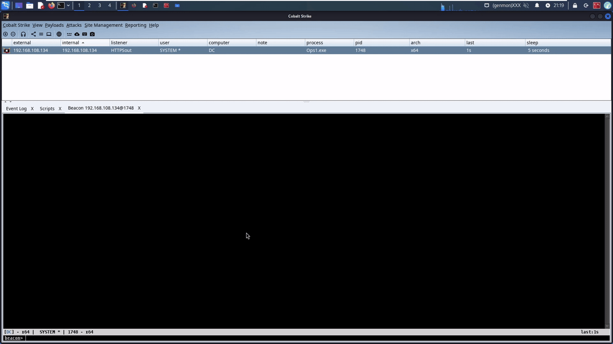

# ADSIsearch
ADSIsearch is a Beacon Object File (BOF) to query Active Directory using ADDS, ADSI, and Network Management WinAPIs.

## Installation
```
cd basicrecon/
x86_64-w64-mingw32-gcc -c basicrecon.c -o basicrecon.x64.o
```
```
cd query/
x86_64-w64-mingw32-gcc -c query.cpp -o query.x64.o
```
Then load the ADSIsearch.cna script into Cobalt Strike.

## Example Usage
Using `basicrecon`:

```ADSIsearch basicrecon```


Using `query`:

```ADSIsearch query <LDAP Query> <Optional Filter>```

```ADSIsearch query (objectCategory=user) samaccountname```

## Demo


## Credits:
My BOF is heavily based off of [Microsoft's example code](https://github.com/microsoft/Windows-classic-samples/tree/main/Samples/Win7Samples/netds/adsi/activedir) and [Outflank's Recon-AD](https://www.outflank.nl/blog/2019/10/20/red-team-tactics-active-directory-recon-using-adsi-and-reflective-dlls/) project. I made this BOF to better understand how these tools worked and also use different parts from both projects to produce what I was looking for.
You can also learn more about these different APIs here:
* [ADDS](https://learn.microsoft.com/en-us/windows/win32/api/dsgetdc/nf-dsgetdc-dsgetdcnamea)
* [ADSI](https://learn.microsoft.com/en-us/windows/win32/api/adshlp/nf-adshlp-adsopenobject)
* [Network Management](https://learn.microsoft.com/en-us/windows/win32/api/lmaccess/nf-lmaccess-netusermodalsget)
